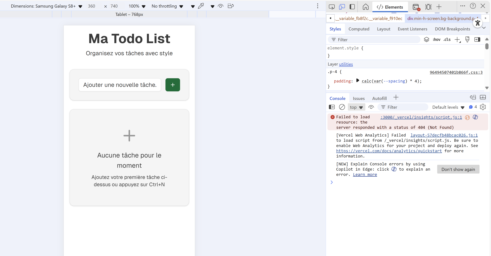

#  BUG-002 - Indication Ctrl+N affichée sur Mobile
**ID Cas de test** : TC_04  
**Environnement** : Mobile  
**Navigateurs / appareils testés :**  
- Windows 11 : Chrome, Edge  
- Android : Chrome (smartphone)  
- iOS : Safari (iPhone)
**Description** : L’indication `Ctrl+N` apparaît sur mobile alors que cette combinaison de touches n’existe pas sur cet environnement.  
**Étapes pour reproduire** :  
1. Ouvrir l’application sur un smartphone ou iPad  
2. Vérifier l’indication dans le champ de saisie  
**Résultat attendu** :  
- Le champ de saisie est accessible normalement  
- Aucune indication `Ctrl+N` n’est affichée  
**Résultat obtenu** :  
- Le champ de saisie affiche une indication `Ctrl+N` inadaptée  
**Statut** : Fail  
**Capture d’écran** : 